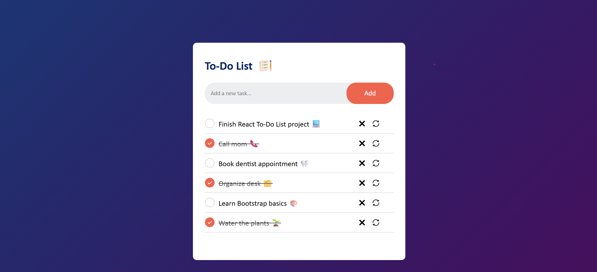

# 📝 To-Do List App

A simple and interactive **To-Do List** built using **HTML, CSS, and JavaScript**.  
This project helps users manage daily tasks with an intuitive interface and persistent storage.

---

## 🚀 Features
- ➕ Add new tasks
- 🗑️ Delete tasks
- ✏️ Edit existing tasks
- ✅ Mark tasks as completed
- 💾 Save tasks using **localStorage** (data persists after refresh)
- 🎨 Responsive design (works on desktop & mobile)

---

## 📸 Screenshots
_Add here a screenshot of your app UI (optional)._  
For example:  


---

## 🛠️ Technologies Used
- **HTML5**
- **CSS3**
- **JavaScript (Vanilla JS)**

---

## 📂 Project Structure
📦 to-do-list
┣ 📜 index.html
┣ 📜 style.css
┣ 📜 script.js
┗ 📜 README.md


---

## 📦 Installation
1. Clone the repository:
   ```bash
   git clone https://github.com/your-username/to-do-list.git
2. Open index.html in your browser.

🎯 Usage

1.Enter a task in the input field.
2.Click Add to save it to the list.
3.Click on a task to mark it as completed.
4.Use edit or delete buttons to modify your tasks.

📌 Future Improvements

. Dark / Light mode toggle 🌙☀️
. Categories or tags for tasks 🏷️
. Due dates & reminders ⏰
. Sync with a database / backend 🔗

🤝 Contributing
Pull requests are welcome! If you’d like to improve this project, please fork the repo and submit a PR.
